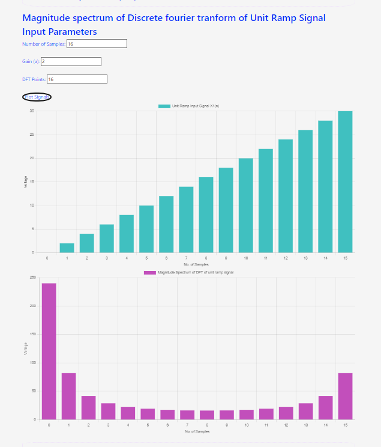
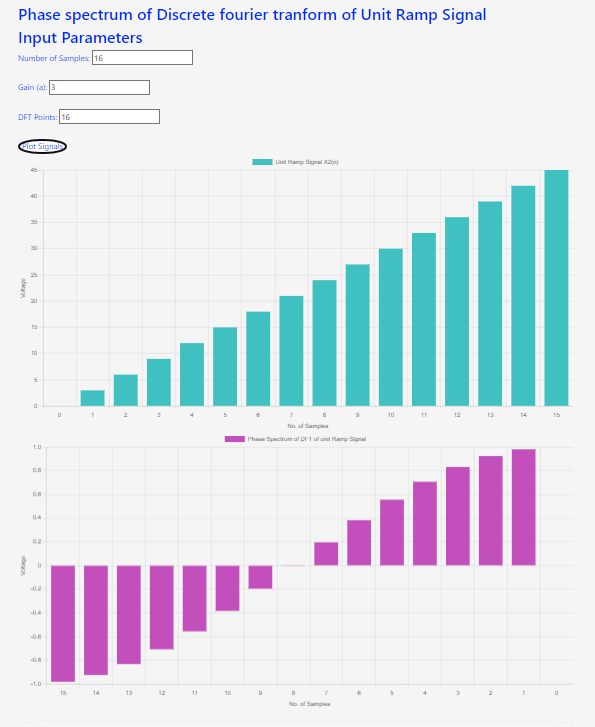
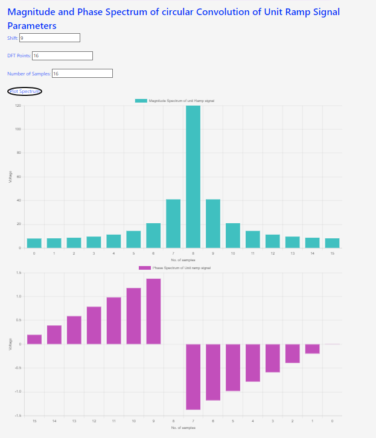

## Procedure

1. Click on the Experiment tab SIMULATOR will open the workspace
                              
2. Read the instruction to understand how the simulation to be executed.

3. Observe the block diagram and power on the circuit

Magnitude spectrum of Discrete fourier tranform of Unit Ramp Signal
Input Parameters

Phase spectrum of Discrete fourier tranform of Unit Ramp Signal
Input Parameters

Magnitude and Phase Spectrum of circular Convolution of Unit Ramp Signal
Parameters

4. Select number of Samples
                            
5. Select the gain of the input ramp signal             
                            
6. Select the sampling frequency of the signal(fs).                   
                            
7. Select the frequency of the signal(fm) for the input signal(x(n)).                 
                               
8. Select DFT ponit for Ramp signal
                              
9. Click on the "Plot spectrum" buttton to observe the Magnitude spectrum of Ramp signal on graph                 
                           
10. Note:                       
- Make sure always number of samples equal to DFT Points >

                            
